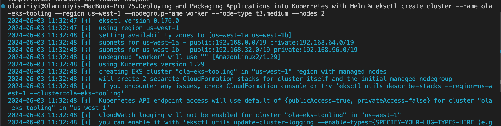
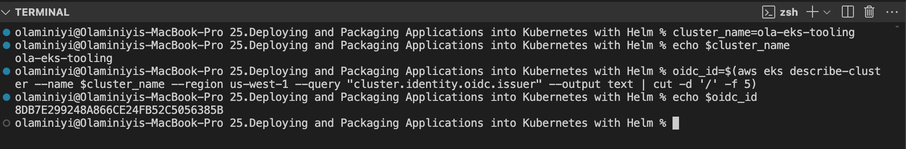
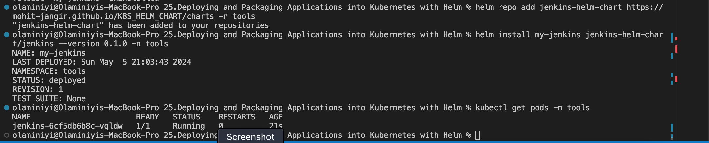

# 25.Deploying and Packaging Applications into Kubernetes with Helm

In [Project-24](https://github.com/Olaminiyi/24.Setting-up-EKS-with-Terraform-Deploying-Jenkins-Server-using-Helm), we acquired practical skills in using Helm to deploy applications on Kubernetes.

Now, in this project, we are focusing on deploying a suite of DevOps tools. Our goal is to confront and understand the typical challenges faced in real-world deployments while mastering effective troubleshooting strategies. We will explore the customization of Helm values files to automate application setups. Throughout the process of deploying different DevOps tools, we'll actively interact with them, comprehending their place in the DevOps lifecycle and how they integrate into the larger ecosystem.

Our primary focus will be on:

- Artifactory
- Ingress Controllers
- Cert-Manager
Then

- Prometheus
- Grafana
- Elasticsearch ELK using [ECK](https://www.elastic.co/guide/en/cloud-on-k8s/current/k8s-install-helm.html).

Artifactory is part of a suit of products from a company called [Jfrog](https://jfrog.com/). Jfrog started out as an artifact repository where software binaries in different formats are stored. Today, Jfrog has transitioned from an artifact repository to a DevOps Platform that includes CI and CD capabilities. This has been achieved by offering more products in which Jfrog Artifactory is part of. Other offerings include

- JFrog Pipelines - a CI-CD product that works well with its Artifactory repository. Think of this product as an alternative to Jenkins.
- JFrog Xray - a security product that can be built-into various steps within a JFrog pipeline. Its job is to scan for security vulnerabilities in the stored artifacts. It is able to scan all dependent code.

### Project Requirement

In this project, the requirement is to use Jfrog Artifactory as a private registry for the organisation's Docker images and Helm charts. This requirement will satisfy part of the company's corporate security policies to never download artifacts directly from the public into production systems. We will eventually have a CI pipeline that initially pulls public docker images and helm charts from the internet, store in artifactory and scan the artifacts for security vulnerabilities before deploying into the corporate infrastructure. Any found vulnerabilities will immediately trigger an action to quarantine such artifacts.

### Deploy Jfrog Artifactory into Kubernetes

First, we provision the kubernetes cluster using eksctl. See [Project-22](https://github.com/Olaminiyi/22.Deploying-application-into-Kubernetes-Cluster).

Create the cluster
```
eksctl create cluster --name ola-eks-tooling2 --region us-west-1 --nodegroup-name worker --node-type t3.medium --nodes 2
```



Create kubeconfig file using awscli and connect to the kubectl.
```
aws eks update-kubeconfig --name ola-eks-tooling --region us-west-1
```

Create a namespace tools where all the DevOps tools will be deployed. We will also be deploying jenkins from the previous project in this namespace.
```
kubectl create ns tools
```


**Create EBS-CSI Driver for the Cluster**

An EBS CSI driver is a crucial component in a Kubernetes cluster that utilizes Amazon Elastic Block Store (EBS) for persistent storage. It enables seamless integration between Kubernetes and EBS, allowing for dynamic provisioning, management, and lifecycle control of EBS volumes for containerized applications.

Here are the key reasons why an EBS CSI driver is essential for a Kubernetes cluster:

1. Dynamic Provisioning: The EBS CSI driver eliminates the need for manual EBS volume creation and configuration, enabling dynamic provisioning of EBS volumes directly within Kubernetes. This streamlines the storage provisioning process and reduces administrative overhead.

2. Automated Attachment: The EBS CSI driver automatically attaches and detaches EBS volumes to the appropriate Kubernetes nodes based on pod scheduling. This ensures that containers have access to the required storage without manual intervention.

3. Volume Lifecycle Management: The EBS CSI driver manages the entire lifecycle of EBS volumes, including creation, deletion, resizing, and snapshotting. This provides a unified approach to storage management within Kubernetes.

4. Simplified Storage Management: The EBS CSI driver simplifies storage management in Kubernetes by decoupling the storage interface from the Kubernetes controller manager. This allows for more efficient storage management and reduces the complexity of the Kubernetes control plane.

5. Enhanced Storage Flexibility: The EBS CSI driver supports a variety of EBS volume configurations, including different volume types, sizes, and performance options. This provides greater flexibility in tailoring storage to specific application requirements.

6. Integration with Kubernetes Ecosystem: The EBS CSI driver is fully integrated with the Kubernetes ecosystem, including Kubernetes PersistentVolumes, PersistentVolumeClaims, and StorageClasses. This allows for seamless integration with existing Kubernetes storage workflows.

Overall, the **EBS CSI** driver plays a critical role in enabling Kubernetes clusters to effectively leverage EBS for persistent storage. It simplifies storage management, automates volume lifecycle operations, and enhances storage flexibility, making it an indispensable tool for Kubernetes environments.

Installing EBS CSI Driver

Run the command to see the pods in the kube-system namespace
```
kubectl get pods -n kube-system
```


By running this command, you will observe the presence of coredns, kube-proxy, and aws-nodes.

Once the Ebs-csi driver is installed, additional nodes related to ebs-csi will appear in the kube-system namespace.

Check the link to setup the EBS CSI add-on

Use this command to check the necessary platform version.
```
aws eks describe-addon-versions --addon-name aws-ebs-csi-driver
```


from the above we can see the platform version
```
 "addonVersion": "v1.30.0-eksbuild.1",
                    "architecture": [
                        "amd64",
                        "arm64"
```

You might already have an **AWS IAM OpenID Connect (OIDC)** provider for your cluster. To confirm its existence or establish a new one, check the **OIDC issuer URL** linked to your cluster. An **IAM OIDC** provider is necessary for utilizing IAM roles with service accounts. You can set up an IAM OIDC provider for your cluster using either **eksctl**** or the **AWS Management Console**.

To create an **IAM OIDC** identity provider for your cluster with **eksctl**

Determine the OIDC issuer ID for your cluster.

Retrieve your cluster's **OIDC issuer ID** and store it in a variable.
```
cluster_name=ola-eks-tooling
```
```
echo $cluster_name
```
```
oidc_id=$(aws eks describe-cluster --name $cluster_name --region us-west-1 --query "cluster.identity.oidc.issuer" --output text | cut -d '/' -f 5)
```
```
echo $oidc_id
```


Check if there's an **IAM OIDC** provider in your account that matches your cluster's issuer ID.
```
aws iam list-open-id-connect-providers | grep $oidc_id | cut -d "/" -f4
```

If output is returned, then you already have an IAM OIDC provider for your cluster and you can skip the next step. If no output is returned, then you must create an IAM OIDC provider for your cluster.

In this case, no output was returned.


Create an **IAM OIDC**** identity provider for your cluster with the following command
```
eksctl utils associate-iam-oidc-provider --cluster $cluster_name --region us-west-1 --approve
```


### Configuring a Kubernetes service account to assume an IAM role

**The code below will create Create a file aws-ebs-csi-driver-trust-policy.json that includes the permissions for the AWS services**

```
cat >aws-ebs-csi-driver-trust-policy.json <<EOF
{
  "Version": "2012-10-17",
  "Statement": [
    {
      "Effect": "Allow",
      "Principal": {
        "Federated": "arn:aws:iam::992382761454:oidc-provider/oidc.eks.us-west-1.amazonaws.com/id/${oidc_id}"
      },
      "Action": "sts:AssumeRoleWithWebIdentity",
      "Condition": {
        "StringEquals": {
          "oidc.eks.us-west-1.amazonaws.com/id/${oidc_id}:aud": "sts.amazonaws.com",
          "oidc.eks.us-west-1.amazonaws.com/id/${oidc_id}:sub": "system:serviceaccount:kube-system:ebs-csi-controller-sa"
        }
      }
    }
  ]
}
EOF

```

This trust policy essentially allows the **EBS CSI** driver to assume the role associated with the specified OIDC provider and access AWS resources on behalf of the EBS CSI controller service account

Create the role - **AmazonEKS_EBS_CSI_DriverRole**
```
aws iam create-role \
  --role-name AmazonEKS_EBS_CSI_DriverRole \
  --assume-role-policy-document file://"aws-ebs-csi-driver-trust-policy.json"
```
Attach a policy. AWS maintains an AWS managed policy or you can create your own custom policy. Attach the AWS managed policy to the role.
```
aws iam attach-role-policy \
  --policy-arn arn:aws:iam::aws:policy/service-role/AmazonEBSCSIDriverPolicy \
  --role-name AmazonEKS_EBS_CSI_DriverRole
```


To add the Amazon **EBS CSI add-on** using the **AWS CLI**

Run the following command.
```
aws eks create-addon --cluster-name $cluster_name --addon-name aws-ebs-csi-driver \
  --service-account-role-arn arn:aws:iam::992382761454:role/AmazonEKS_EBS_CSI_DriverRole --region us-west-1
```


Execute the command, you will find the ebs-csi driver related pods available.
```
kubectl get pods -n kube-system
```


### Installing the tools in kubernetes

The best approach to easily get tools into kubernetes is to use helm.

Install jenkins in the namespace tools using helm

Search for an official helm chart for jenkins on Artifact Hub.
```
helm repo add jenkins-helm-chart https://mohit-jangir.github.io/K8S_HELM_CHART/charts
```
```
helm install my-jenkins jenkins-helm-chart/jenkins --version 0.1.0 -n tools
```
+++++++++++++++++++++++++++++++++++++++++++++++++++++++++++++++++++++++++++++++++++++++++++++++
- I got an error after installing jenkins with the pod being in pending status for a long time
- I tried another one provider which solves the problem
+++++++++++++++++++++++++++++++++++++++++++++++++++++++++++++++++++++++++++++++++++++++++++++++

```
kubectl get pods -n tools
```
```
kubectl get pods -n tools -w
```



### Install artifactory in the namespace tools

Search for an official helm chart for Artifactory on [Artifact Hub](https://artifacthub.io/).


Click on install to display the commands for installation. on the right hand side of the page


Add the repo
```
helm repo add jfrog https://charts.jfrog.io
```
Update the helm repo index on my local machine/laptop
```
helm repo update
```
Install artifactory in the namespace tools
```
helm upgrade --install artifactory jfrog/artifactory --version 107.71.4 -n tools
```


We opted for the **upgrade --install** flag over **helm install** artifactory jfrog/artifactory for enhanced best practices, especially in CI pipeline development for helm deployments. This approach guarantees that helm performs an upgrade if an installation exists. In the absence of an existing installation, it conducts the initial install. This strategy assures a fail-safe command; it intelligently discerns whether an upgrade or a fresh installation is needed, preventing failures.

To see the various versions; scrow down and check the right side of the page and click on see all link


**Getting the Artifactory URL**

The artifactory helm chart comes bundled with the Artifactory software, a PostgreSQL database and an Nginx proxy which it uses to configure routes to the different capabilities of Artifactory. Getting the pods after some time, you should see something like the below.
```
kubectl get pods -n tools -w
```


Each of the deployed application have their respective services. This is how you will be able to reach either of them.

Notice that, the Nginx Proxy has been configured to use the service type of LoadBalancer. Therefore, to reach Artifactory, we will need to go through the Nginx proxy's service. Which happens to be a load balancer created in the cloud provider.
```
kubectl get svc -n tools
```


**Accessing the artifactory using the Load balancer URL***
Login using default

**username: admin**

**password: password**


**How the Nginx URL for Artifactory is configured in Kubernetes**

How did **Helm** configure the **URL** in kubernetes?

Helm uses the values.yaml file to set every single configuration that the chart has the capability to configure. The best place to get started with an off the shelve chart from artifacthub.io is to get familiar with the DEFAULT VALUES section on Artifact hub.


**Explore key and value pairs within the system.**

For instance, entering "nginx" into the search bar will display all the configured options for the nginx proxy. Choosing **"nginx.enabled"**** from the list will promptly navigate you to the corresponding configuration in the YAML file.


Search for **nginx.service**** and choose **nginx.service.type**. This will display the configured Kubernetes service type for **Nginx**. By default, it appears as **LoadBalancer**.


To work directly with the values.yaml file, you can download the file locally by clicking on the download icon.


### Ingress controller

Configuring applications in Kubernetes to be externally accessible often begins with setting the service type to a Load Balancer. However, this can lead to escalating expenses and complex management as the number of applications grows, resulting in a multitude of provisioned load balancers.

An optimal solution lies in leveraging Kubernetes Ingress instead, as detailed in Kubernetes Ingress documentation. Yet, this transition requires deploying an Ingress Controller.

One major advantage of employing an Ingress controller is its **ability to utilize a single load balancer across various deployed applications**. This consolidation allows for the reuse of the load balancer by services like Artifactory and other tools. Consequently, it significantly reduces cloud expenditure and minimizes the overhead associated with managing multiple load balancers, a topic we'll delve deeper into shortly.

For now, we will leave artifactory, move on to the next phase of configuration (Ingress, DNS(Route53) and Cert Manager), and then return to Artifactory to complete the setup so that it can serve as a private docker registry and repository for private helm charts.

### Deploying Ingress Controller and managing Ingress Resources

An ingress in Kubernetes is an API object responsible for overseeing external access to services within the cluster. It handles tasks like load balancing, SSL termination, and name-based virtual hosting. Essentially, an Ingress facilitates the exposure of HTTP and HTTPS routes from outside the cluster to services within cluster. Traffic direction is managed by rules set within the Ingress resource.

To illustrate, here is a straightforward example where an Ingress directs all its traffic to a single Service


eksctl create iamserviceaccount  --name ebs-csi-controller-sa  --namespace kube-system  --cluster $cluster_name  \
  --attach-policy-arn  arn:aws:iam::aws:policy/service-role/AmazonEBSCSIDriverPolicy  --approve  --role-only  \
  --role-name  AmazonEks_EBS_CSI_DriverRole  


eksctl create addon --cluster $cluster_name --name aws-ebs-csi-driver \
  --service-account-role-arn arn:aws:iam::992382761454:role/AmazonEKS_EBS_CSI_DriverRole --region us-east-1 --force


aws iam create-role \
  --role-name AmazonEKS_EBS_CSI_DriverRole \
  --assume-role-policy-document file://"aws-ebs-csi-driver-trust-policy.json"

aws iam attach-role-policy \
  --policy-arn arn:aws:iam::aws:policy/service-role/AmazonEBSCSIDriverPolicy \
  --role-name AmazonEKS_EBS_CSI_DriverRole


## create cluster

- eksctl create cluster --name ola-eks-tooling --region us-east-1 --nodegroup-name worker --node-type t3.medium --nodes 2

## Create kubeconfig file 

- aws eks update-kubeconfig --name ola-eks-tooling --region us-east-1

## create namespace

- kubectl create ns tools

## check for version

- aws eks describe-addon-versions --addon-name aws-ebs-csi-driver


## create an **IAM OIDC** identity provider for your cluster with **eksctl**

- cluster_name=ola-eks-tooling

- oidc_id=$(aws eks describe-cluster --name $cluster_name --region us-east-1 --query "cluster.identity.oidc.issuer" --output text | cut -d '/' -f 5)

- echo $oidc_id

## Check if there's an **IAM OIDC** provider in your account that matches your cluster's issuer ID

- aws iam list-open-id-connect-providers | grep $oidc_id | cut -d "/" -f4

## Create an **IAM OIDC**** identity provider for your cluster
- eksctl utils associate-iam-oidc-provider --cluster $cluster_name --region us-east-1 --approve

## Create the role - **AmazonEKS_EBS_CSI_DriverRole**

aws iam create-role \
  --role-name AmazonEKS_EBS_CSI_DriverRole \
  --assume-role-policy-document file://"aws-ebs-csi-driver-trust-policy.json"

## Attach a policy. AWS maintains an AWS managed policy or you can create your own custom policy. Attach the AWS managed policy to the role.

aws iam attach-role-policy \
  --policy-arn arn:aws:iam::aws:policy/service-role/AmazonEBSCSIDriverPolicy \
  --role-name AmazonEKS_EBS_CSI_DriverRole


## add the Amazon **EBS CSI add-on** using the **AWS CLI**

aws eks create-addon --cluster-name $cluster_name --addon-name aws-ebs-csi-driver \
  --service-account-role-arn arn:aws:iam::992382761454:role/AmazonEKS_EBS_CSI_DriverRole --region us-west-2

## Add the repo

helm repo add jfrog https://charts.jfrog.io

## Update the helm repo index on my local machine/laptop

helm repo update

## Install artifactory in the namespace tools

helm upgrade --install artifactory jfrog/artifactory --version 107.71.4 -n tools


{
  "Version": "2012-10-17",
  "Statement": [
    {
      "Effect": "Allow",
      "Principal": {
        "Federated": "arn:aws:iam::992382761454:oidc-provider/oidc.eks.us-east-1.amazonaws.com/id/$oidc_id"
      },
      "Action": "sts:AssumeRoleWithWebIdentity",
      "Condition": {
        "StringEquals": {
          "oidc.eks.us-east-1.amazonaws.com/id/$oidc_id:aud": "sts.amazonaws.com",
          "oidc.eks.us-east-1.amazonaws.com/id/$oidc_id:sub": "system:serviceaccount:kube-system:ebs-csi-controller-sa"
        }
      }
    }
  ]
}